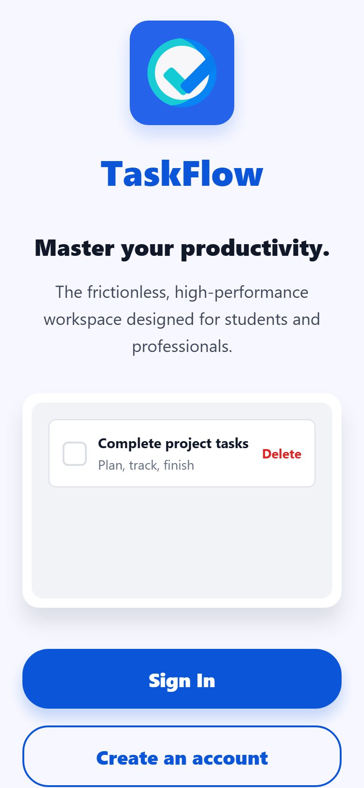
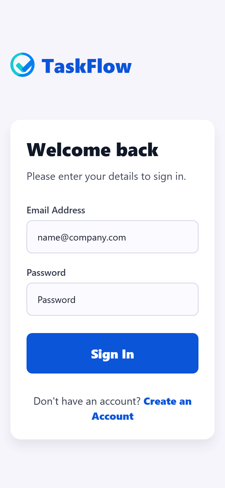
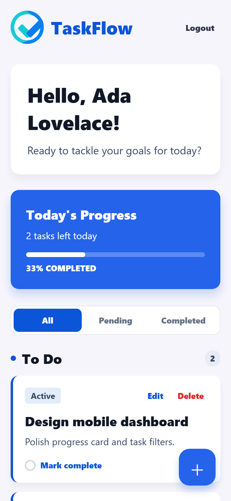
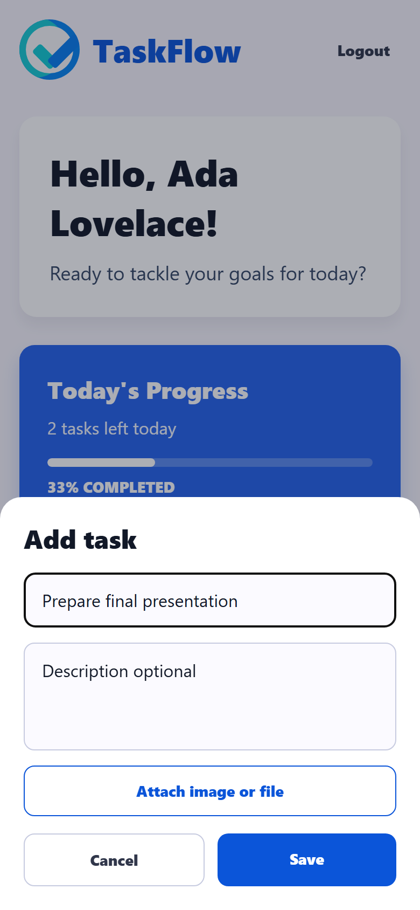

# Task Tracker App

Full-stack Task Tracker app with a Node.js/Express API and an Expo React Native mobile client.

## Stack

- Backend: Node.js, Express, TypeScript, MongoDB, Mongoose, JWT, bcryptjs
- Mobile: Expo, React Native, TypeScript, TanStack Query, Axios, expo-secure-store

## Project Structure

```text
backend/  Express API
mobile/   Expo mobile app
```

## Environment

Backend example: [backend/.env.example](backend/.env.example)

```env
PORT=5000
MONGO_URI=mongodb://127.0.0.1:27017/task-tracker
JWT_SECRET=replace-this-with-a-long-random-secret
```

Mobile example: [mobile/.env.example](mobile/.env.example)

```env
EXPO_PUBLIC_API_URL=http://localhost:5000
```

For Android emulator, use `http://10.0.2.2:5000`. For a physical phone, use your computer's LAN IP, such as `http://192.168.1.10:5000`.

## Run Backend

```bash
cd backend
npm install
cp .env.example .env
npm run dev
```

The API runs on `http://localhost:5000` by default.

## Run Mobile

```bash
cd mobile
npm install
cp .env.example .env
npm start
```

Open the app with Expo Go, an emulator, or a development build.

## Features

- Signup and login
- Persisted login session with SecureStore on mobile and localStorage on web
- Logout
- Authenticated task APIs
- Create tasks with title and optional description
- Edit task title and description
- Attach one image or file to a task
- Mark tasks completed or pending
- Delete tasks
- Filter tabs: All, Pending, Completed
- Loading, error, empty, and pull-to-refresh states

## API Summary

- `POST /auth/signup`
- `POST /auth/login`
- `GET /tasks`
- `POST /tasks`
- `PATCH /tasks/:id`
- `DELETE /tasks/:id`
- `POST /tasks/upload`

Passwords are hashed with bcryptjs. Authenticated task routes require a JWT bearer token.

## Demo Video

Demo video: [Task-app Demo-Vedio.webm](docs/media/Task-app%20Demo-Vedio.webm)

<video src="docs/media/Task-app%20Demo-Vedio.webm" controls width="320"></video>

## Screenshots

These screenshots were captured from the running Expo web app and backend.








